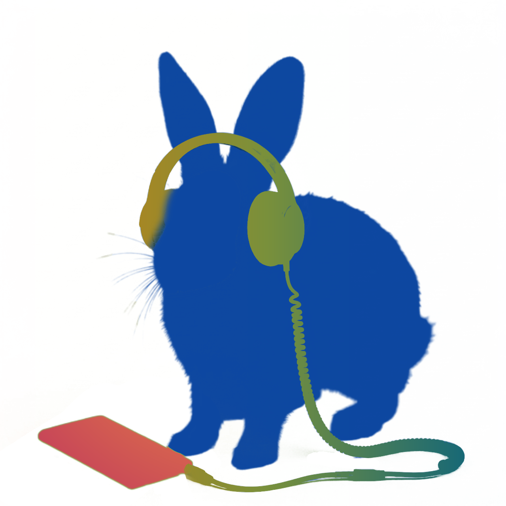

  

<h1 align="center">Xargoosh Music Player</h1>

A private, local-first Android music player with the tools a personal library deserves.

Xargoosh is made for people who keep their own music collection and want a capable player without ads, accounts, or tracking. Your library, playlists, queue, and settings stay on your device, while optional online features remain under your control.

## Features

- Browse music by album, artist, genre, folder, playlist, or favorites
- Shape playback with queue editing, gapless transitions, ReplayGain, equalizer, and sleep timer
- Follow synchronized lyrics and personalize the player with themes and visualizers
- Edit metadata, use home-screen widgets, and recognize nearby music on demand
- Choose from 22 app languages, including full RTL layouts

## Requirements

- Android Studio with JDK 17
- Android SDK 36
- Android 10 or newer (API 29)

## Music Recognition

The development build uses AudD's public demo token, which is limited to 10 shared requests per day. Public releases should route recognition through a secured backend with production credentials.

## Privacy

See [PRIVACY_POLICY.md](PRIVACY_POLICY.md).
